# Funil do cliente (pré-processual) — diagrama

> Gerado de `fluxo_transicoes` por `gerar_governanca.py`. Governa `clientes.status`.

```mermaid
flowchart TD
    LEAD(["Lead (primeiro contato)<br/><small>Captação · 3d</small>"])
    DOCUMENTACAO["Documentação<br/><small>Documentação · 7d</small>"]
    ENTREVISTA["Entrevista<br/><small>Atendimento · 5d</small>"]
    PETICAO_PENDENTE["Petição a redigir<br/><small>Jurídico · 2d</small>"]
    PETICAO_EM_CRIACAO["Petição em redação<br/><small>Jurídico · 3d</small>"]
    PETICAO_AGUARDANDO_APROVACAO["Petição aguardando aprovação<br/><small>Petição Inicial · 2d</small>"]
    PETICAO_APROVADA["Petição aprovada, a distribuir<br/><small>Jurídico · 2d</small>"]
    STAND_BY["Stand by<br/><small>Atendimento · 60d</small>"]
    DISTRIBUIDO["Distribuído (concluído)<br/><small>Jurídico</small>"]
    CANCELADO["Cancelado<br/><small>Atendimento</small>"]
    PRESCRITO["Prescrito<br/><small>Jurídico</small>"]
    SEM_RESPOSTA["Sem resposta<br/><small>Captação</small>"]

    CANCELADO -->|"Reabrir o caso (GESTOR) 🔒"| DOCUMENTACAO
    DISTRIBUIDO -->|"Novo caso da mesma pessoa (ADVOGADO) 🔒"| DOCUMENTACAO
    DOCUMENTACAO -->|"Cancelar 🔒"| CANCELADO
    DOCUMENTACAO -->|"Documentação completa 🔒"| ENTREVISTA
    DOCUMENTACAO -->|"Prescrição consumada (ADVOGADO) 🔒"| PRESCRITO
    DOCUMENTACAO -->|"Sem resposta"| SEM_RESPOSTA
    DOCUMENTACAO -->|"Colocar em stand by"| STAND_BY
    ENTREVISTA -->|"Cancelar 🔒"| CANCELADO
    ENTREVISTA -->|"Voltar para documentação 🔒"| DOCUMENTACAO
    ENTREVISTA -->|"Entrevista realizada 🔒"| PETICAO_PENDENTE
    ENTREVISTA -->|"Prescrição consumada (ADVOGADO) 🔒"| PRESCRITO
    ENTREVISTA -->|"Sem resposta"| SEM_RESPOSTA
    ENTREVISTA -->|"Colocar em stand by"| STAND_BY
    LEAD -->|"Cancelar 🔒"| CANCELADO
    LEAD -->|"Contrato assinado 🔒"| DOCUMENTACAO
    LEAD -->|"Sem resposta"| SEM_RESPOSTA
    LEAD -->|"Colocar em stand by"| STAND_BY
    PETICAO_AGUARDANDO_APROVACAO -->|"Cancelar (ADVOGADO) 🔒"| CANCELADO
    PETICAO_AGUARDANDO_APROVACAO -->|"Aprovar a inicial (ADVOGADO) 🔒"| PETICAO_APROVADA
    PETICAO_AGUARDANDO_APROVACAO -->|"Devolver para ajuste (ADVOGADO) 🔒"| PETICAO_EM_CRIACAO
    PETICAO_APROVADA -->|"Cancelar (ADVOGADO) 🔒"| CANCELADO
    PETICAO_APROVADA -->|"Registrar distribuição (ADVOGADO) 🔒"| DISTRIBUIDO
    PETICAO_APROVADA -->|"Reabrir redação (ADVOGADO) 🔒"| PETICAO_EM_CRIACAO
    PETICAO_APROVADA -->|"Prescrição consumada (ADVOGADO) 🔒"| PRESCRITO
    PETICAO_EM_CRIACAO -->|"Cancelar 🔒"| CANCELADO
    PETICAO_EM_CRIACAO -->|"Falta documento 🔒"| DOCUMENTACAO
    PETICAO_EM_CRIACAO -->|"Falta informação: nova entrevista 🔒"| ENTREVISTA
    PETICAO_EM_CRIACAO -->|"Enviar para aprovação 🔒"| PETICAO_AGUARDANDO_APROVACAO
    PETICAO_EM_CRIACAO -->|"Prescrição consumada (ADVOGADO) 🔒"| PRESCRITO
    PETICAO_PENDENTE -->|"Cancelar 🔒"| CANCELADO
    PETICAO_PENDENTE -->|"Começar a redigir"| PETICAO_EM_CRIACAO
    PETICAO_PENDENTE -->|"Prescrição consumada (ADVOGADO) 🔒"| PRESCRITO
    PETICAO_PENDENTE -->|"Colocar em stand by 🔒"| STAND_BY
    PRESCRITO -->|"Reanalisar prescrição (ADVOGADO) 🔒"| PETICAO_PENDENTE
    SEM_RESPOSTA -->|"Cancelar 🔒"| CANCELADO
    SEM_RESPOSTA -->|"Reabrir contato"| ENTREVISTA
    SEM_RESPOSTA -->|"Prescrição consumada (ADVOGADO) 🔒"| PRESCRITO
    STAND_BY -->|"Cancelar 🔒"| CANCELADO
    STAND_BY -->|"Retomar documentação"| DOCUMENTACAO
    STAND_BY -->|"Retomar entrevista"| ENTREVISTA
    STAND_BY -->|"Retomar petição 🔒"| PETICAO_PENDENTE
    STAND_BY -->|"Prescrição consumada (ADVOGADO) 🔒"| PRESCRITO
    STAND_BY -->|"Sem resposta"| SEM_RESPOSTA

    classDef inicial fill:#dcfce7,stroke:#16a34a,color:#14532d
    class LEAD inicial
    classDef final fill:#e5e7eb,stroke:#6b7280,color:#374151
    class DISTRIBUIDO,CANCELADO,PRESCRITO,SEM_RESPOSTA final
```

🔒 = a ação só aparece quando o pré-requisito está cumprido. O que cada um exige está
em [`../governanca.md`](../governanca.md).
