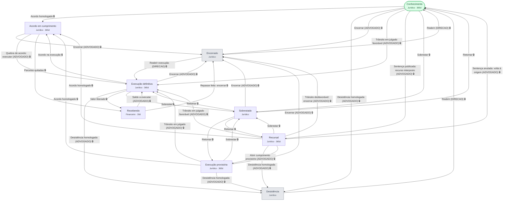

# Ciclo do processo — diagrama

> Gerado de `fluxo_transicoes` por `gerar_governanca.py`. Governa `processos.fase`.

🔒 = a ação só aparece quando o pré-requisito está cumprido. O que cada um exige está
em [`../governanca.md`](../governanca.md).
