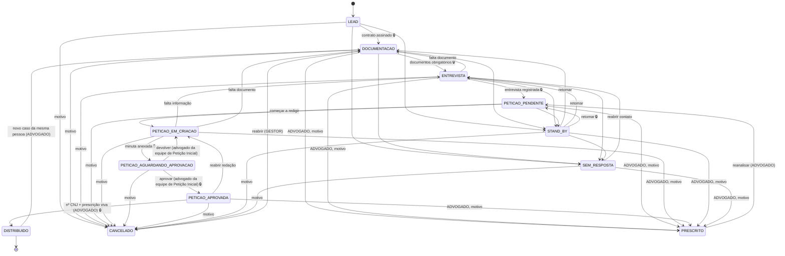
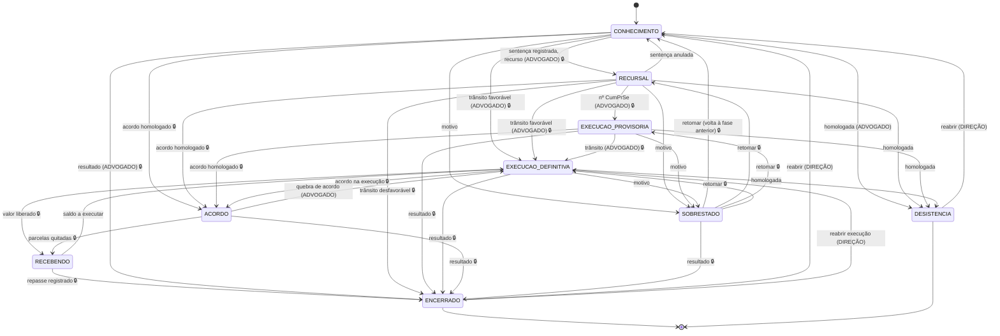
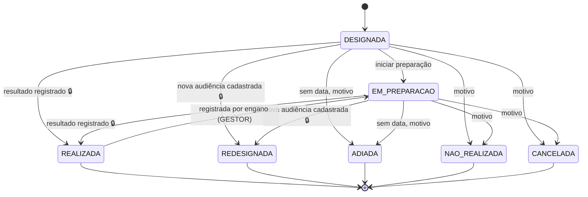
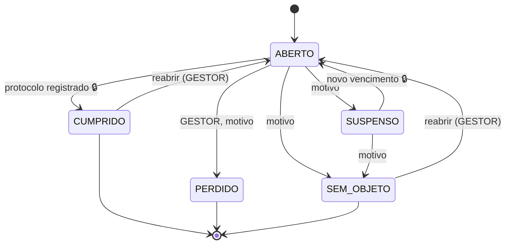
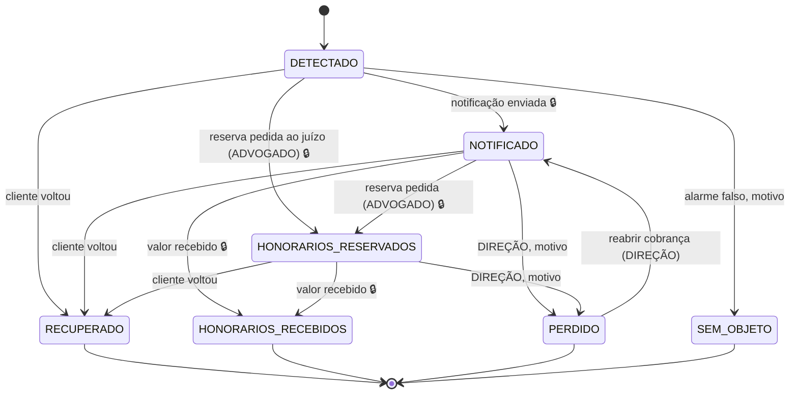

# Governança do trabalhista — para o Lucas ler e aprovar antes de virar código

> Proposta do arquiteto, 03/09/2026. Saiu de três coisas: as opções de select do Airtable (o que o
> escritório já faz), o rito da CLT (o que a lei manda) e o modelo do Prev (como se escreve regra que o
> banco recusa). O que está **[CONFIRMAR]** depende de você ou do Glauco; o número entre parênteses é a
> pergunta em `perguntas-para-lucas.md`. O mesmo mapa, em forma de tabela gerada, está em `governanca.md`;
> o que cada opção do Airtable virou está em `etapa-ou-atributo.md`; o SQL é `../governanca.sql`.
>
> **Como ler:** cada máquina tem etapas (onde um caso fica), transições (o botão que leva de uma a outra),
> quem pode apertar o botão, e o que trava (`exige`). Transição fora do mapa é **recusada pelo banco**, não
> corrigida. Toda mudança fica no histórico com quem, quando e por quê. Prazo interno (SLA) é o tempo além
> do qual o caso aparece na fila de "parados" — não é meta de produtividade, é o ponto em que alguém pergunta.

**5 máquinas · 40 etapas · 111 transições · 18 tipos de prazo.** No Airtable eram 14 selects de estado
com ~120 opções, sem histórico e sem trava.

| máquina | governa | o que responde |
|---|---|---|
| CLIENTE | `clientes.status` | Onde está a pessoa, do primeiro contato à distribuição da inicial |
| PROCESSO | `processos.fase` | Em que fase está o processo em juízo |
| AUDIÊNCIA | `audiencias.situacao` | Cada audiência: designada, preparada, realizada |
| PRAZO | `prazos.situacao` | Cada prazo processual: aberto, cumprido, perdido |
| INCIDENTE | `incidentes.situacao` | O cliente que trocou de advogado: notificar, reservar honorários, recuperar |

O que **não** virou máquina, e por quê, está no fim (§6).

---

## 1. CLIENTE — o pré-processual

A pessoa é **uma ficha só**, desde o primeiro contato até virar cliente com processo. Não há tabela de
lead à parte nem tabela de pré-processual: é a mesma linha mudando de `status`. O processo aponta para ela;
uma pessoa com dois processos é uma ficha e dois processos — hoje são dois registros que só o nome liga.

### As etapas

| etapa | o que significa | quem toca | tempo aceitável | vai para | o que trava |
|---|---|---|---|---|---|
| **LEAD** | Ligou ou o captador trouxe. Sabemos nome, telefone, empresa, função e como saiu (ou se ainda trabalha). **Não existe no Airtable** — lá a pessoa só entra depois de assinar. **[CONFIRMAR 5]**: onde ficam os leads hoje, e o portal deve recebê-los? | Captação | 3 dias | DOCUMENTACAO, STAND_BY, SEM_RESPOSTA, CANCELADO | Só avança com **contrato de honorários e procuração assinados e datados**. |
| **DOCUMENTACAO** | Contrato assinado. A Documentação pede TRCT, CTPS, holerites, extrato do FGTS, RG/CNH e, se houver, documentos médicos e provas. Cada documento é uma linha com "recebido em" ou "dispensado, porque". | Documentação | 7 dias | ENTREVISTA, STAND_BY, SEM_RESPOSTA, CANCELADO, PRESCRITO | Só passa para entrevista com os **documentos obrigatórios** recebidos ou dispensados com motivo. **[CONFIRMAR 7]**: a lista de PENDENCIAS de hoje marca o que falta ou o que foi pedido? Define como migrar 551 fichas. |
| **ENTREVISTA** | Agendar e fazer a entrevista; registrar data, entrevistador, resumo, se o caso pede perícia médica ou técnica, e as testemunhas. Os "1º/2º/3º contato" viraram um **contador** na ficha, não etapas — três estados que só diziam "quantas vezes liguei" e que ninguém usava (2 registros em 797). "Entrevista agendada" e "remarcar" são o evento na agenda. | Atendimento (entrevistadores) | 5 dias | PETICAO_PENDENTE, DOCUMENTACAO, STAND_BY, SEM_RESPOSTA, CANCELADO, PRESCRITO | Para seguir, **entrevista registrada** (data + resumo). Hoje o resumo só existe em 51 fichas **[CONFIRMAR 9]**: onde fica o conteúdo? |
| **PETICAO_PENDENTE** | Caso pronto para a inicial, ainda sem redator. Rescisão indireta aparece em vermelho aqui. | Jurídico | 2 dias | PETICAO_EM_CRIACAO, STAND_BY, CANCELADO, PRESCRITO | — |
| **PETICAO_EM_CRIACAO** | Alguém está redigindo. Se faltar informação volta para entrevista; se faltar documento, para documentação — sem apagar o feito. | Jurídico | 3 dias | PETICAO_AGUARDANDO_APROVACAO, ENTREVISTA, DOCUMENTACAO, CANCELADO, PRESCRITO | Para enviar à aprovação, a **minuta anexada** na ficha. |
| **PETICAO_AGUARDANDO_APROVACAO** | A minuta espera quem aprova. **É o gargalo de hoje: 54 esperando contra 6 em redação.** Por isso virou etapa própria, com dono e SLA curto. | **Petição Inicial** (resposta 8, 03/09/2026) | 2 dias | PETICAO_APROVADA, PETICAO_EM_CRIACAO (devolver), CANCELADO | Aprovar, devolver e cancelar exigem papel **ADVOGADO** e pertencer ao setor **Petição Inicial** (gate `setor_peticao_inicial`, que lê `pessoas.setor`; no banco, `pessoa_no_setor(id, 'Petição Inicial')`). Devolver exige o ajuste escrito. Gestor e Direção não aprovam por hierarquia [CONFIRMAR: a Direção também pode?]. |
| **PETICAO_APROVADA** | Protocolar no PJe e registrar o número CNJ. É esse registro que **faz nascer o processo** no sistema (fluxo 2), copiando tudo — e não só nome, telefone e empresa como a automação de hoje. | Jurídico (advogado) | 2 dias | DISTRIBUIDO, PETICAO_EM_CRIACAO, CANCELADO, PRESCRITO | **Número CNJ de 20 dígitos** e **prescrição viva**: se a demissão faz mais de 2 anos, o sistema não distribui sem uma dispensa justificada escrita na ficha (contrato vivo, causa interruptiva, decisão consciente de arriscar). |
| **STAND_BY** | Parado por decisão da pessoa ou fato que vai amadurecer. A prescrição continua correndo, e a tela mostra. | Atendimento | 60 dias | DOCUMENTACAO, ENTREVISTA, PETICAO_PENDENTE, SEM_RESPOSTA, CANCELADO, PRESCRITO | — |
| **DISTRIBUIDO** (final) | A inicial foi distribuída. O trabalho segue no processo. Equivale ao CONCLUÍDO do Airtable, com nome que diz o que aconteceu. | Jurídico | — | DOCUMENTACAO (novo caso da mesma pessoa, com motivo) | — |
| **CANCELADO** (final) | A pessoa desistiu ou o escritório não seguiu. Junta os três "DESISTÊNCIA" do Airtable e o CANCELAMENTO num lugar só, **com motivo obrigatório** — hoje a automação cancela sem dizer por quê nem quando. | Atendimento | — | DOCUMENTACAO (reabrir, GESTOR) | Motivo. |
| **PRESCRITO** (final) | Dois anos do fim do contrato sem ajuizar (CF art. 7º, XXIX; CLT art. 11). Só advogado registra, com motivo. É perda evitável e precisa aparecer como número — hoje há 2 marcados e 156 fichas com a data vencida. | Jurídico | — | PETICAO_PENDENTE (reanalisar) | Papel ADVOGADO + motivo. |
| **SEM_RESPOSTA** (final) | Não retornou. Reabre se procurar. | Captação | — | ENTREVISTA, CANCELADO, PRESCRITO | — |

### O que o escritório faz diferente da CLT aqui (e o sistema respeita)

- **A ordem documentação → entrevista** é a inferida do Airtable. Juridicamente tanto faz; operacionalmente
  decide quem cobra quem. **[CONFIRMAR]** se a entrevista vem antes em algum caso — o mapa permite voltar,
  mas não permite pular.
- **SLA de 20 dias da assinatura à distribuição.** A soma dos SLAs das etapas dá 21 (7+5+2+3+2+2); as
  automações 🟡15/🔴20 viraram a view `v_pre_processual_atrasado` **[CONFIRMAR 6]**. Para **rescisão indireta**
  o vermelho acende em 15 — o contrato ainda está correndo (CLT art. 483), e o n8n já cobra em 5/10/12/15
  **[CONFIRMAR 10]**: cobra quem, e o que acontece no 15º dia? Não virou etapa: é urgência que atravessa
  todas as etapas.
- **Prescrição bienal é trava no banco**, não aviso: `gov_prescricao_bienal` recusa o INSERT do processo
  quando `data_demissao + 2 anos` já passou e não há dispensa escrita. É o espelho do Tema 350 do Prev. A
  **quinquenal** (só alcança 5 anos para trás) não trava nada — é conta da petição **[CONFIRMAR 11]**: querem
  que o sistema calcule o período alcançado?
- **Modalidade da rescisão vira lista fechada** (sem justa causa, justa causa, pedido de demissão, rescisão
  indireta, contrato vivo, acordo do art. 484-A). Hoje é texto livre em 20 grafias, e a automação da RI só
  pega quem escreveu exatamente "RESCISÃO INDIRETA" — os 2 com "RECISÃO" ficam de fora.

---

## 2. PROCESSO — da distribuição ao arquivo

É a FASE PROCESSUAL do Airtable, limpa e com trava. O que o script de autopreenchimento fazia por
inferência (viu data de sentença → SENTENCIADA; viu Nº CumPrSe → EXECUÇÃO PROVISÓRIA) aqui é **transição
declarada com gate**: a pessoa aperta o botão, o sistema confere se o fato está registrado.

### As etapas

| etapa | o que significa | quem toca | tempo aceitável | o que trava a saída |
|---|---|---|---|---|
| **CONHECIMENTO** | Da distribuição à sentença: audiência inicial/una/instrução, defesa, réplica, perícias, testemunhas. "Aguardando audiência", "aguardando perícia", "aguardando sentença" e "sentenciada" **deixam de ser status**: saem da agenda de audiências, das perícias e da sentença registrada. | Jurídico (advogado do processo) | 365 dias | Recorrer ou executar exige a **sentença registrada** (resultado objetivo, data, nota). Encerrar exige **resultado final**. |
| **RECURSAL** | Há recurso pendente — nosso, da reclamada ou de ambos. TRT ou TST sai dos recursos registrados (RO/contrarrazões = TRT; RR/AIRR/embargos = TST). Isso responde à pergunta 22: a tabela de recursos diz **de quem** é cada um. | Jurídico | 365 dias | Trânsito exige a data registrada. Cumprimento provisório exige o **número do CumPrSe**. |
| **EXECUCAO_PROVISORIA** | Cumprimento provisório de sentença enquanto a reclamada recorre (CLT art. 899): liquidação e penhora até a garantia do juízo, sem levantar dinheiro antes do trânsito. **Quando o processo está em recurso e em CumPrSe ao mesmo tempo (77 casos hoje), a fase é esta** — é onde o escritório trabalha; o recurso pendente aparece pelos prazos, não pela fase. | Jurídico | 365 dias | Virar definitiva exige o **trânsito registrado**. |
| **EXECUCAO_DEFINITIVA** | Trânsito em julgado favorável. Cálculo → impugnação (8 dias, art. 879 §2º) → homologação → pesquisa de bens → alvará. A **situação interna** (aguardando cálculo, cálculos apresentados, perícia contábil, homologado, agravo de petição, pesquisa patrimonial, negociando, parcelamento 916, aguardando alvará) é um **atributo com lista fechada e ordenada** — os 16 estados limpos da CÓPIA, menos os que eram fase disfarçada. Não é máquina governada porque a execução não é linear: bens, acordo, alvará e recurso se alternam, e 60 transições recusando mudança legítima seria pior que o select. O que precisa de trava está aqui na fase e nos prazos. **[CONFIRMAR 18]** a lista e a ordem em `etapa-ou-atributo.md`. | Jurídico | 365 dias | Receber exige **valor recebido** registrado (valor, data, comprovante). |
| **ACORDO** | Acordo homologado, parcelas correndo. Pode vir de qualquer fase (audiência inicial, instrução, recursal, execução — a CÓPIA tem "conciliação em execução"). Cada parcela é uma linha com vencimento e "pago em"; "pagamento em dia/atrasado/parcial" é conta, não select. Acordo é o desfecho mais comum da casa (1.382 na CÓPIA contra 2.118 sentenças). | Jurídico | 365 dias | Entrar exige **acordo registrado** (valor, parcelas, vencimentos, homologação). Sair para RECEBENDO exige **todas as parcelas pagas**. Quebra vai para EXECUCAO_DEFINITIVA com motivo (título executivo judicial). |
| **RECEBENDO** | O dinheiro entrou (alvará ou última parcela). Separar honorários contratuais e sucumbência, **registrar o repasse ao cliente** com comprovante. É o pós-processual do Airtable, que lá tinha STATUS REPASSE vazio em 556 de 556. Aqui o tempo é nosso — 30 dias. | Financeiro | 30 dias | Encerrar exige **repasse registrado** (ou "não há valor a repassar", com motivo). **[CONFIRMAR 26]**: o repasse se registra aqui ou no financeiro? O gate lê a tabela, venha de onde vier. |
| **SOBRESTADO** | Suspenso por decisão do juízo: tema repetitivo, IRR, recuperação judicial da reclamada. Registra o motivo e o que destrava. Ao retomar, **só volta para a fase em que estava** — o histórico diz qual. | Jurídico | sem SLA | Entrar exige motivo; retomar exige que o destino seja a fase anterior. |
| **ENCERRADO** (final) | Acabou. O **resultado final** diz como: ARQUIVADO (definitivo), ARQUIVADO_PROVISORIO (sem bens — art. 11-A CLT, prescrição intercorrente em 2 anos), IMPROCEDENTE transitada, EXTINTO sem resolução, EXECUÇÃO SATISFEITA, ARQUIVADO POR AUSÊNCIA (art. 844), SEM RECEBIMENTO. Ao encerrar nasce a tarefa "arquivar pasta" (o STATUS ARQUIVAMENTO do PÓS). **[CONFIRMAR 28]**: ENCERRADO (fase), ARQUIVADO (status judicial) e STATUS ARQUIVAMENTO (Drive) — três coisas, e o desenho trata assim: fase, resultado, tarefa. | Jurídico | — | Reabrir só a **Direção**, com motivo. |
| **DESISTENCIA** (final) | O reclamante desistiu depois de ajuizar e o juízo homologou (CPC art. 485, VIII; depois da defesa precisa da anuência da reclamada, CLT art. 841 §3º). Saída própria, separada de ENCERRADO, porque não é resultado do mérito. | Jurídico | — | Papel ADVOGADO + motivo. |

### O que ficou de fora da fase, de propósito

- **Redistribuir** (1 caso) é ação, não lugar: o processo velho fica ENCERRADO/ARQUIVADO com a tarefa
  "redistribuir"; ao ser feita, nasce processo novo em CONHECIMENTO com `redistribuido_de`. Duas ausências
  do reclamante em processos sobre o mesmo objeto geram perempção de 6 meses (CLT art. 732) — a tela avisa.
- **Roubado / recebido por eles / recuperado / revogação / notificação** são o fluxo 5 (§5). O processo
  continua em juízo com outro patrono; o que muda é a nossa representação.
- **Ausência do reclamante** é motivo da audiência não realizada (fluxo 3) + resultado final do processo.
  Fica medível por captador e entrevistador, que é o que importa.
- **Complexidade A/B/C, rito, valor da causa, turma, relator, notas RUIM/MÉDIA/ÓTIMA** são atributos;
  **sentença, acórdão, trânsito, cálculo homologado, acordo, recebimento, repasse** são fatos em tabelas
  filhas — e é a presença deles que os gates conferem.
- **"Execução" sem qualificação** (125 registros) não existe mais. A migração decide: há Nº CumPrSe e não
  há trânsito → provisória; senão → definitiva, com conferência aberta se não houver trânsito registrado.

### Onde o escritório e a CLT divergem, e o que o desenho faz

- A CLT não tem "fase recursal" como a base usa: o processo permanece no 1º grau até subir. O escritório usa
  RECURSAL para "há recurso pendente", e o desenho mantém, porque é assim que a equipe pensa o trabalho.
- **Execução provisória e recurso pendente coexistem** — a base tinha 77 casos em dois lugares. Decisão:
  a fase é a execução; o recurso é prazo/registro. **Reversível** se você preferir RECURSAL como fase e a
  execução provisória como flag.
- **Parcelamento do art. 916 do CPC** na execução trabalhista é controverso (o TST tem entendimentos
  contrários). Está na lista de situações porque a base o usa (9+4 casos) **[CONFIRMAR]** se o escritório
  aceita ou impugna.

---

## 3. AUDIÊNCIA — cada audiência é uma linha

O Airtable guardava **uma** audiência por processo e sobrescrevia a anterior; a redesignada apagava a
história. Aqui cada audiência é uma linha, com tipo, modalidade, data, checklist de preparação e resultado.

| etapa | o que significa | quem toca | o que trava |
|---|---|---|---|
| **DESIGNADA** | O juízo marcou. Tipo (INICIAL, INSTRUÇÃO, UNA, HOMOLOGAÇÃO, CONCILIAÇÃO EM EXECUÇÃO, JULGAMENTO) e modalidade (PRESENCIAL, VÍDEO) são atributos — "UNA/VIDEO" vira UNA + VÍDEO; "UNA-RS" vira UNA + rito sumaríssimo no processo **[CONFIRMAR 17]**. | Jurídico | — |
| **EM_PREPARACAO** | Checklist na própria linha: **cliente orientado**, **testemunhas confirmadas** (e intimação pedida se alguma falhou — art. 825 CLT: testemunha comparece sem intimação; se não vier, o juízo intima), **ad video feito** **[CONFIRMAR 14]** o que é o ad video e quem faz, **documentos e proposta de acordo prontos**. Na una a defesa vem na hora: a réplica se prepara aqui. Entra-se ao marcar o primeiro item. | Jurídico | — |
| **REALIZADA** (final) | Aconteceu. O **resultado** é obrigatório: acordo, defesa juntada, instrução encerrada, sentença designada, convertida em diligência. É o resultado que abre os prazos (réplica, razões finais) e move o processo. | Jurídico | Resultado registrado. |
| **REDESIGNADA** (final) | Nova data marcada. A nova audiência é **outra linha**, ligada por `redesignada_de`; só se fecha esta depois de cadastrar aquela. | Jurídico | Nova audiência cadastrada. |
| **ADIADA** (final) | Adiada sem data. Quando o juízo designar, nasce outra linha. | Jurídico | Motivo. |
| **NAO_REALIZADA** (final) | Não aconteceu: **ausência do reclamante** (arquivamento, art. 844 CLT, e custas se não justificar em 15 dias), ausência da reclamada (revelia, art. 844), falta de intimação, problema técnico. O motivo fica na audiência e alimenta o mapa de perda evitável por captador/entrevistador — a CÓPIA tem 126 ausências. | Jurídico | Motivo. |
| **CANCELADA** (final) | Perdeu o objeto: acordo antes da data, desistência, extinção. | Jurídico | Motivo. |

**O alerta de preparação.** `v_audiencias_sem_preparacao` lista audiência designada/em preparação a
**7 dias corridos ou menos** sem nenhum item do checklist marcado. Proposta de N = 7 **[CONFIRMAR]**:
confirmar testemunha e, se falhar, pedir intimação leva uma semana; menos que isso não dá tempo de reagir.
Para audiência inicial (só conciliação e defesa) 3 dias bastariam — se quiser, N por tipo.

**Onde o escritório e a CLT divergem.** A CLT do rito ordinário prevê audiência una (art. 849) e o
fracionamento inicial/instrução é prática dos TRTs; no sumaríssimo a una é regra (art. 852-C). O desenho não
impõe sequência de tipos — o juízo decide — só exige que cada uma seja registrada. Audiência de
**julgamento** (publicação da sentença em audiência) conta o prazo do RO da data, mesmo que ninguém compareça
(Súmula 197 TST): por isso o resultado "sentença publicada em audiência" cria o prazo automaticamente, como
proposta para o Jurídico confirmar.

---

## 4. PRAZO — o que o Airtable não sabia que existia

Não havia noção de prazo processual na base — só data de audiência, perícia e a prescrição bienal. O
Astrea fazia isso **[CONFIRMAR 4]**: continua? Aqui o prazo nasce da **publicação no DEJT**, da intimação no
PJe, da ata de audiência ou de despacho, e é contado pelo sistema.

| etapa | o que significa | quem toca | o que trava |
|---|---|---|---|
| **ABERTO** | Correndo. O vencimento está na linha; o SLA é o próprio vencimento, por isso não há `sla_dias`. A fila mostra os mais próximos primeiro (`v_prazos_criticos`). | Jurídico (responsável do prazo), Publicação lê o diário | Cumprir exige **data de protocolo e a peça** (ou o número do protocolo do PJe). |
| **SUSPENSO** | Suspenso por decisão do juízo, recesso ou força maior (CLT art. 775 §1º). | Jurídico | Retomar exige o **novo vencimento recontado**. |
| **CUMPRIDO** (final) | Protocolado no prazo. | Jurídico | — |
| **PERDIDO** (final) | Venceu sem protocolo. **Só gestor registra, com motivo.** O banco recusa PERDIDO sem motivo. É o pior número do escritório e precisa existir para ser contado, não escondido em "arquivado". | Gestão | Papel GESTOR + motivo (gatilho `gov_prazo_regras`). |
| **SEM_OBJETO** (final) | O prazo morreu por acordo, desistência ou decisão que o tornou desnecessário. Existe para que "perdido" nunca seja sujado por prazo que simplesmente deixou de importar. | Jurídico | Motivo. |

### Como se conta (e o banco garante)

- **Dias úteis** (CLT art. 775, redação da Lei 13.467/2017). Prazo em dias corridos é recusado pelo gatilho
  `gov_prazo_regras` salvo justificativa escrita — é o erro que faz descartar prazo vivo. Diferente do Prev,
  que conta em corridos pela Lei 11.419 no JEF.
- **Começa** no primeiro dia útil depois da publicação; **publicação** é o primeiro dia útil depois da
  **disponibilização** no DEJT (Lei 11.419/2006, art. 4º §§ 3º e 4º). Intimação em audiência conta da
  audiência (Súmula 197 TST). Intimação pessoal no PJe: da leitura ou do 10º dia (Lei 11.419 art. 5º §3º).
- **Feriados**: nacionais, estaduais e municipais da sede da vara, os do TRT (portarias: Carnaval, Corpus
  Christi, dia do servidor, ponto facultativo) e o **recesso de 20/12 a 20/01**, que suspende prazo (CLT
  art. 775-A). A tabela de feriados por TRT é do `prazo_legal.py` do trabalhista — o do Prev não serve.
- **Embargos de declaração interrompem** o prazo do recurso principal (CPC art. 1.026): ao registrar ED
  cumprido, o prazo de RO/RR fica SUSPENSO e reabre com a publicação do julgamento.

### Os tipos, com o prazo legal em dias úteis

| tipo | dias | fundamento | observação |
|---|---|---|---|
| Réplica (manifestação sobre a defesa) | **o juízo fixa**; sistema propõe 5 | CPC art. 218 §3º c/c CLT art. 769; defesa em audiência: art. 847 | **[CONFIRMAR]** o padrão do TRT-2 (5, 10 ou 15?). Na una a réplica é oral ou no prazo que o juiz dá na ata. |
| Manifestação sobre documentos | juízo fixa; propõe 5 | CPC art. 437 §1º (15 dias) c/c 769 | **[CONFIRMAR]** |
| Razões finais | juízo fixa; propõe 5 | CLT art. 850: 10 minutos orais; memoriais no prazo do juízo | Só é prazo quando convertida em memoriais. |
| Manifestação sobre laudo | juízo fixa; propõe 15 | CPC art. 477 §1º (15 dias) c/c 769 | Perícia médica e técnica. **[CONFIRMAR]**: as varas dão 5, 10 ou 15? |
| Embargos de declaração | **5** | CLT art. 897-A; CPC art. 1.023 | Interrompem o recurso principal. |
| Recurso ordinário | **8** | CLT art. 895, I | Reclamante com gratuidade: sem depósito (art. 899 §10) nem custas (art. 790 §3º) **[CONFIRMAR]** se a gratuidade é pedida como regra. |
| Contrarrazões | **8** | CLT art. 900; Lei 5.584/70 art. 6º | Abre quando a reclamada recorre. |
| Recurso adesivo | **8** | CPC art. 997 §2º; Súmula 283 TST | Mesmo prazo das contrarrazões. |
| Recurso de revista | **8** | CLT art. 896 | No sumaríssimo só por súmula/CF (§9º). |
| Agravo de instrumento (AIRR) | **8** | CLT art. 897, b | Contra o despacho que nega o RR. |
| Agravo interno / regimental | **8** | CLT art. 896 §12; regimentos; Lei 5.584 art. 6º | |
| Embargos à SDI (TST) | **8** | CLT art. 894, II | |
| Impugnação aos cálculos | **8** | CLT art. 879 §2º | Sob pena de preclusão, item a item. Também na provisória. |
| Impugnação à sentença de liquidação | **5** | CLT art. 884 §3º | Do exequente, mesmo prazo dos embargos do executado. |
| Agravo de petição | **8** | CLT art. 897, a | Contra homologação, extinção e decisões na execução. |
| Manifestação na execução | juízo fixa; propõe 5 | CPC art. 218 §3º | Bens negativos, alvará, parcelamento. |
| Emenda à inicial | **15** | CPC art. 321 c/c CLT art. 769 | **[CONFIRMAR]** se alguma vara fixa 10. |
| Outro | juízo fixa; propõe 5 | CPC art. 218 §3º | Nome do ato na descrição. |

O que a CLT não cobre vem do CPC por aplicação subsidiária (CLT art. 769; CPC art. 15). Onde a lei cala e
o juiz também, 5 dias (CPC art. 218 §3º) — e o sistema **propõe**, a pessoa **confirma**; a correção fica no
histórico. Isso é a regra 6 do Prev (a máquina propõe, a pessoa decide) aplicada ao prazo.

---

## 5. INCIDENTE — o cliente que trocou de advogado

ROUBADO (66), RECEBIDO POR ELES (38), RECUPERADO (18), REVOGAÇÃO, NOTIFICAÇÃO e as PROVIDENCIAS ("NOTIFICAR",
"TRAVAR O RECEBIMENTO") viviam no STATUS DO PROCESSO e em campos soltos — e o script de autopreenchimento os
tratava como "protegidos", porque são decisão humana. **Não são fase do processo**: o processo continua em
juízo, com outro patrono. São um ciclo à parte, ligado ao processo por `incidentes.processo_id`, com o
objetivo de **receber os honorários pelo trabalho feito ou trazer o cliente de volta**.

| etapa | o que significa | quem toca | tempo aceitável | o que trava |
|---|---|---|---|---|
| **DETECTADO** | Apareceu outro patrono nos autos ou o cliente avisou. Confirmar nos autos (há revogação juntada? — `revogacao_nos_autos_em`), avisar o cliente (`cliente_avisado_em`) e decidir. Notificação "redigida" e não enviada ainda é detectado. | Jurídico | 5 dias | — |
| **NOTIFICADO** | Notificação extrajudicial enviada cobrando os honorários pelo trabalho feito. Recebimento e resposta são datas na linha. Sem resposta em 30 dias, pedir reserva nos autos. **[CONFIRMAR 21]**: existe modelo da notificação? quem redige, quem envia? | Jurídico | 30 dias | Entrar exige **data de envio e cópia** da notificação. |
| **HONORARIOS_RESERVADOS** | Pedido de reserva/destaque de honorários protocolado nos autos (EOAB art. 22 §4º) — é o "travar o recebimento / travar última parcela" das PROVIDENCIAS. O juízo retém a parcela; acompanha-se junto com a execução. | Jurídico (advogado) | sem SLA | Entrar exige a **petição protocolada**. |
| **RECUPERADO** (final) | O cliente voltou. Conferir procuração nova e revogação do outro nos autos. | Jurídico | — | — |
| **HONORARIOS_RECEBIDOS** (final) | O escritório recebeu o que lhe cabia. | Financeiro | — | Valor recebido registrado. |
| **PERDIDO** (final) | Cliente e honorários perdidos — o "recebido por eles". **Só a Direção fecha assim, com motivo**: é o número que mede o roubo de cliente, e não pode ser fechado no automático. | Direção | — | Papel DIREÇÃO + motivo. |
| **SEM_OBJETO** (final) | Não houve troca: substabelecimento nosso, homônimo, leitura errada do diário. | Jurídico | — | Motivo. |

**Como se liga ao processo.** Enquanto há incidente aberto, a ficha do processo mostra o sinal em toda tela
que leva a ele (padrão `alertas.py` do Prev). Quando o processo chega a RECEBENDO com incidente aberto, a
tela avisa antes do repasse — é exatamente o momento de reservar. A fase do processo **não muda** por causa
do incidente. O tipo do incidente (TROCA_DE_ADVOGADO, REVOGACAO_PELO_CLIENTE, **[CONFIRMAR]** outros) é
atributo.

**REVOGAÇÃO tem dois sentidos** na base **[CONFIRMAR 20]**: em 529 processos normais significa que *nós*
juntamos a revogação do advogado anterior do cliente (vira `processos.revogou_patrono_anterior` + data); nos
roubados significa que o cliente *nos* revogou (vira `incidentes.revogacao_nos_autos_em`). A migração usa o
STATUS DO PROCESSO para decidir o sentido; os 9 recados ("BRUNO - juntar revogação nestes autos") viram
tarefa com dono.

---

## 6. O que NÃO virou máquina, e por quê

| candidato | decisão | porquê |
|---|---|---|
| **Pós-processual** (recebimento, repasse, arquivamento) | **Fase do PROCESSO**, não máquina | RECEBENDO e ENCERRADO já são o recebimento e o arquivo. O **repasse** é dinheiro: linha em `repasses` (valor, data, comprovante), exigida pelo gate antes de encerrar — o STATUS REPASSE que ficou vazio em 556/556 vira obrigação. O **arquivamento** físico/Drive é tarefa que nasce ao encerrar. Uma quarta tabela "PÓS" só repetiria o processo, como a do Airtable repetiu (99 órfãos, valores copiados no instante e nunca atualizados). **[CONFIRMAR 3, 26, 28]** |
| **Status internos do processo** (conhecimento, recursal, CumPrSe, cálculo, acordo, pagamento) | **Atributos derivados de fatos**, ou lista fechada sem gatilho | "Aguardando audiência/sentença/acórdão" são o próximo evento da agenda; "sentenciada" é a sentença registrada; TRT/TST é o recurso pendente; cálculo é a tabela `calculos`; pagamento é a tabela de parcelas. A **execução** ganha `situacao_execucao` com 12 valores ordenados, sem gatilho, porque não é linear. Cada opção está em `etapa-ou-atributo.md`. |
| **Testemunha** (PENDENTE → A CONFIRMAR → CONFIRMADA; DESCARTADA, NAO USAR) | Atributo com CHECK | Cinco valores, caminho óbvio, sem gate que valha a pena. O que importa para a audiência é `confirmada_em`. |
| **Perícia** (médica, técnica, contábil) | Tabela `pericias` com datas (designada, realizada, laudo), sem máquina | Três datas descrevem tudo; o prazo de manifestação sobre o laudo é o fluxo PRAZO. |
| **Recurso** (RO, RR, AIRR, AP…) | Tabela `recursos` (tipo, de quem, interposto em, resultado, julgado em), sem máquina | O ciclo de vida do recurso é o prazo (fluxo 4) mais o resultado (fato). Responde "recurso de quem" (pergunta 22) e dá o grau da fase RECURSAL. |
| **Tarefa** | Já existe no Prev (`tarefas`, distribuição automática) | AND. NECESSÁRIO, PROVIDENCIAS, AVISOS, os recados de REVOGAÇÃO: tudo tarefa com dono e prazo. |

---

## 7. Decisões que tomei sozinho — você pode reverter qualquer uma

1. **Petição inicial em quatro etapas** (pendente, em redação, aguardando aprovação, aprovada), em vez de uma
   etapa PETIÇÃO com status. Motivo: o gargalo de aprovação precisa de dono e SLA visíveis. Reverter =
   fundir em uma etapa e mover o status para atributo.
2. **Contatos 1º/2º/3º da entrevista como contador**, não etapas. Reverter = três etapas entre ENTREVISTA
   e o agendamento — eu não recomendo: 2 registros em 797 usam.
3. **CANCELADO absorve as três DESISTÊNCIAs** e o CANCELAMENTO, com motivo obrigatório. Reverter = etapa
   DESISTENCIA separada no cliente, como fiz no processo.
4. **DISTRIBUIDO como final do cliente**, com "novo caso da mesma pessoa" reabrindo o funil. Alternativa: um
   registro de "caso" por pessoa (a pessoa fica ACEITO, cada caso pré-processual é linha própria). Faz
   diferença para quem tem dois processos; hoje são poucos.
5. **Fase EXECUCAO_PROVISORIA vence RECURSAL** quando as duas coexistem. Reverter = RECURSAL como fase e o
   CumPrSe como flag.
6. **DESISTENCIA do processo como etapa final separada de ENCERRADO.** Reverter = resultado_final =
   DESISTENCIA dentro de ENCERRADO.
7. **SOBRESTADO só volta para a fase anterior** (gate lê o histórico). Reverter = permitir qualquer destino
   com papel ADVOGADO.
8. **situacao_execucao é atributo com lista fechada, não sub-máquina.** Reverter = fluxo 6 com as 12
   situações e gatilho — eu recomendo esperar seis meses de uso para ver se o caminho é estável.
9. **Incidente é a 5ª máquina**, e PERDIDO só a Direção fecha. Reverter = flags no processo (roubado_em,
   recuperado_em) sem ciclo — perde-se a fila "notificar" e "reservar".
10. **Prazo PERDIDO só gestor**, e SEM_OBJETO existe. Reverter = qualquer papel fecha perdido.
11. **N = 7 dias corridos** para o alerta de audiência sem preparação; um N só, para todos os tipos.
12. **SLAs**: LEAD 3, DOCUMENTACAO 7, ENTREVISTA 5, petição 2+3+2+2, STAND_BY 60; fases judiciais 365;
    RECEBENDO 30; incidente DETECTADO 5, NOTIFICADO 30. Todos são um `UPDATE fluxo_etapas`.
13. **Padrões de prazo quando o juízo fixa**: réplica 5, documentos 5, razões finais 5, laudo 15, emenda 15,
    execução 5. São `dias_padrao` em `prazo_tipos`; a pessoa corrige na tela.
14. **Setores** usados no mapa: Captação, Documentação, Atendimento (entrevistadores e responsáveis
    iniciais), Jurídico, Petição Inicial (quem aprova a inicial — resposta 8), Gestão (prazo perdido),
    Financeiro, Direção, Publicação. A base só tem FUNCOES
    **[CONFIRMAR 30]**; `equipe.py` traduz.
15. **Dois gatilhos além do mapa**: prescrição bienal barra o INSERT do processo sem dispensa
    (`gov_prescricao_bienal`); prazo em dias corridos sem justificativa, CUMPRIDO sem data e PERDIDO sem
    motivo são recusados (`gov_prazo_regras`). E um terceiro, `gov_nasce_na_inicial`: linha nova só nasce na
    etapa inicial — a migração desliga de propósito e religa no fim.

## 8. O que depende das suas respostas (perguntas 1–34)

| pergunta | o que muda no mapa se a resposta for outra |
|---|---|
| 3 (PÓS órfãos) | 99 registros ficam em `airtable_bruto` ou viram processos sem número |
| 4 (Astrea) | se continua, o fluxo PRAZO nasce das publicações dele; senão, do DEJT/AASP direto |
| 5 (leads) | etapa LEAD fica ou sai; se sai, o fluxo começa em DOCUMENTACAO com `contrato_assinado` no INSERT |
| 6 (SLA 15/20) | os SLAs das seis etapas do pré e o farol da view |
| 7 (PENDENCIAS) | como migrar 551 fichas para `documentos_pendentes` — e se o gate `documentos_obrigatorios` fecha as 172 COMPLETAS com 4 marcações |
| 8 (quem aprova) | **respondida e implementada**: papel ADVOGADO + gate `setor_peticao_inicial` na transição AGUARDANDO_APROVACAO → APROVADA / EM_CRIACAO / CANCELADO; grupo da etapa = Petição Inicial. Depende de `pessoas.setor` (pergunta 30) |
| 9 (entrevista) | modalidade como atributo do evento; se o resumo fica no Drive, o gate `entrevista_registrada` aceita link |
| 10 (RI 15 dias) | o farol da RI e para quem nasce a tarefa no 15º dia |
| 11 (prescrição) | se a quinquenal entra como cálculo do período alcançado na ficha |
| 14 (ad video) | item do checklist da audiência fica, sai, ou vira evento com responsável |
| 16 (complexidade) | se A/B/C muda a distribuição de tarefa (peso) ou só o relatório |
| 17 (UNA-RS, classes) | rito no processo; classes de incidente na tabela de recursos |
| 18 (status execução) | a lista e a ordem de `situacao_execucao` |
| 19 (AND. NECESSÁRIO) | confirma que vira tarefa |
| 20 (REVOGAÇÃO) | os dois sentidos e como a migração separa |
| 21 (roubado) | as etapas do INCIDENTE e quem toca cada uma |
| 22 (recurso de quem) | a coluna `recursos.parte` e o grau da fase RECURSAL |
| 24 (notas) | `decisoes.nota` fica ou sai |
| 26 (repasse) | onde se grava o repasse; o gate `repasse_registrado` lê a tabela de qualquer jeito |
| 28 (três arquivamentos) | fase ENCERRADO + resultado ARQUIVADO + tarefa "arquivar pasta" |
| 30 (organograma) | os grupos das etapas e a hierarquia de papéis (ADVOGADO < GESTOR < DIRECAO) |

As demais (1, 2, 12, 13, 15, 23, 25, 27, 29, 31–34) afetam migração, financeiro e integrações — não o mapa.
